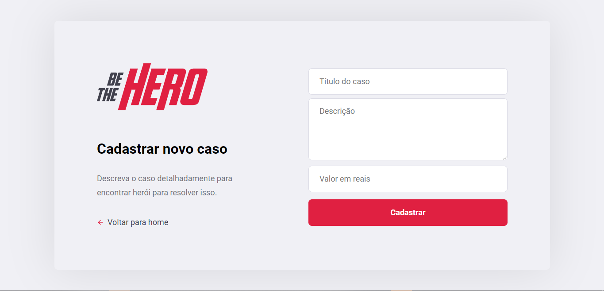
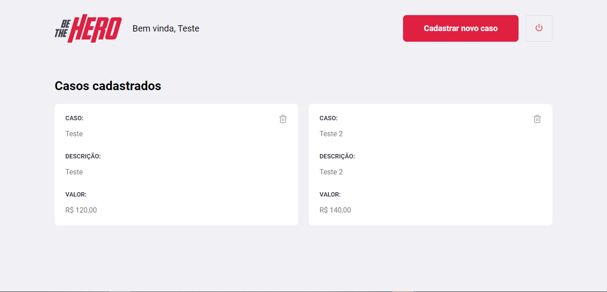
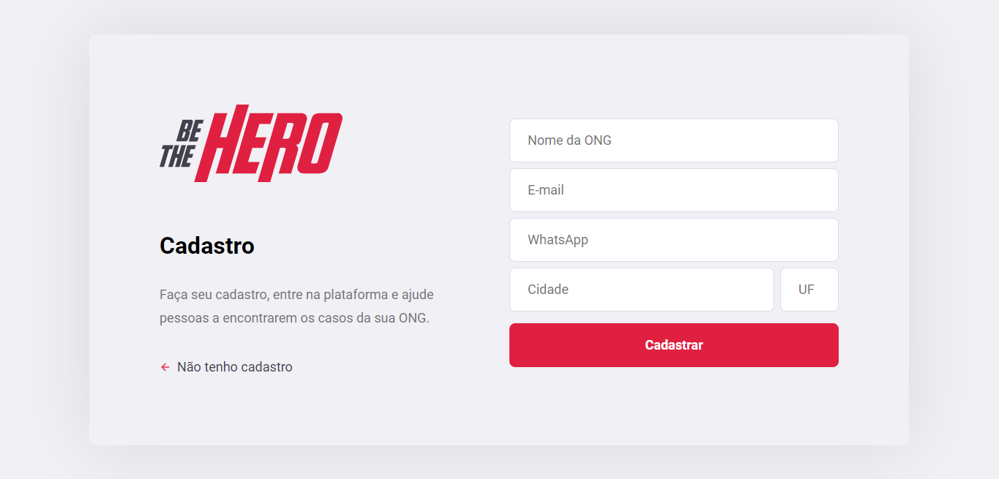

<h1 align="center">
    
</h1>

## Ambiente do projeto

* Clone o repositório, execute o comando <code>$ npm install</code> para instalar todas as dependências;
* Execute o comando <code>$ yarn dev</code> para iniciar a aplicação WEB na porta 3000.

# Páginas

  

  

  

  

